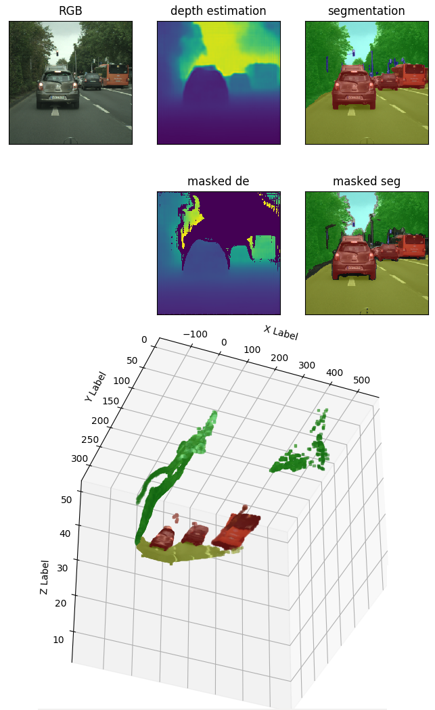
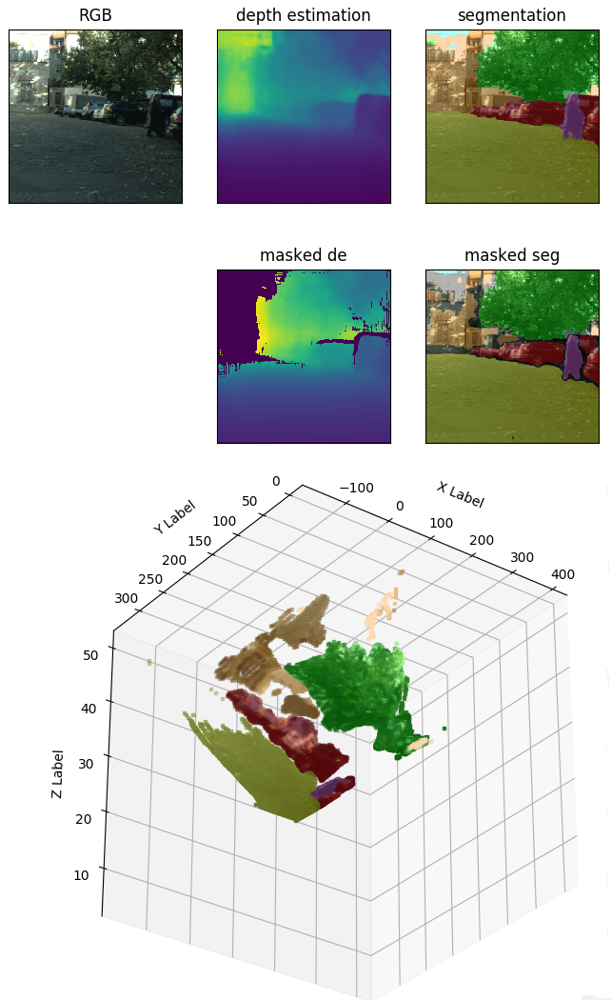
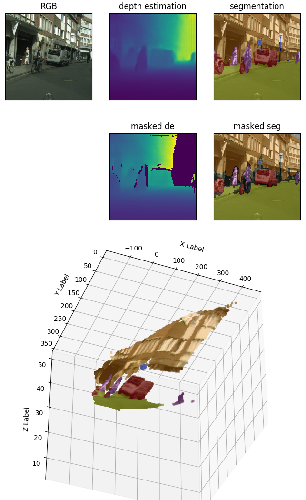

3D Scene Reconstruction From Single Monocular Images Using Deep Learning - Work in Progress
============================================
My aim is to build a labeled 3D point cloud from monocular driving images. I predict depth and semantic information separately with two CNNs. Then, the depth predictions are used to build the point cloud and the points are labeled based on the segmentation.


### CNNs
The networks' architecture is similar to the one described in the following paper:
Károly Harsányi, Attila Kiss, András Majdik, Tamás Szirányi: A Hybrid CNN Approach for Single Image Depth Estimation: A Case Study. IWCIM - 6th International Workshop on Computational Intelligence for Multimedia Understanding, 2018.
The approach described in the paper is [implemented with pytorch](https://github.com/karoly-hars/DE_resnet_unet_hyb).

The model for depth estimation has the exact same structure as the one in the paper. It is trained on the [Cityscapes dataset](https://www.cityscapes-dataset.com/dataset-overview/). I used all the available images from the 'train' and 'trainextra' subsets for training. 

The model for segmentation also has a similar structure, but the last layer has 7 output channels for the 7 labels I used. It was trained on the [BDD100K](http://bair.berkeley.edu/blog/2018/05/30/bdd/) dataset.  It categorizes pixels into the following classes: flat surfaces, buildings, street furniture, vegetation, sky, humans, and vehicles.

Both networks were trained on images with a size of 320x320 pixels. Their output size is 160x160. It is upsampled to 320x320 pixels to match the input image's size.

Since the datasets contain driving images, it is ill-advised to use these models for predictions in any other environment. 

### Building the 3D Point Cloud
The depth estimation has a higher error rate around the edges of the objects, which can cause discrepancies in the point cloud. To prevent this, depth pixels with high gradients are masked out. It is also possible to use the segmented image to detect the edges of the objects by examining the certainties of the semantic prediction. If the model shows a high uncertainty for a pixel (i.e. the max value for the pixel after the final softmax layer is lower than a threshold), the corresponding voxel is left out from the point cloud. Furthermore, I left out the voxels from the point cloud which were predicted to be farther away than 50 meters, and every voxel that is classified into the 'sky' category.

Based on the focal length of our camera and the depth estimation we can transform image coordinates into 3D coordinates. The points in the point cloud are then colored based on their predicted semantic label.

### Requirements
The code was tested with:
- python 3.5 and 3.6
- pytorch (and torchvision) 1.0.0 or higher
- opencv-python 3.4.3
- matplotlib 2.2.3
- numpy 1.15.4
- colormap 1.0.2
- easydev 0.9.37

I used an NVIDIA card with ~8 GB memory for testing. Since the two networks will not necessarily fit into the memory of a single GPU it might be more practical to modify the code and run the depth and semantic predictions sequentially instead of parallelly.

### How to
```sh
python3 predict_img.py <path_to_image> <focal_lenght>
```
### Examples
The example images were sampled from the validation set of the Cityscapes dataset. The images were cropped to hide the hood of the 'ego vehicle'.

Munster98          |  Munster116
:-------------------------:|:-------------------------:
 | 

Lindau38          |  Munster43
:-------------------------:|:-------------------------:
 | 

 
### Remarks
- the point clouds capture a very narrow region because a 320x320 image only represents a narrow slice of the environment. 
- it seems that the depth estimation is often inaccurate around street furniture (poles, traffic signs, etc).


### ToDo
- use PCL or some other similar point cloud library for display instead of matploblib.
- use some outlier detection on the point cloud for further improvement.
- retrain the networks for larger (and wider) inputs, or just switch to more accurate CNNs.

